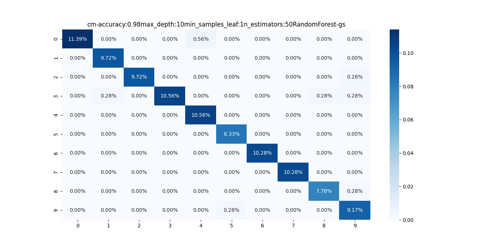

# Directory Structure
```text
.
├── figures
│   ├── Figure_cm-accuracy:0.97max_depth:10min_samples_leaf:2n_estimators:20RandomForest-gs.png
│   ├── Figure_cm-accuracy:0.97max_depth:15min_samples_leaf:1n_estimators:30RandomForest-gs.png
│   ├── Figure_cm-accuracy:0.98max_depth:10min_samples_leaf:1n_estimators:50RandomForest-gs.png
│   └── RandomForest-gs-graph.svg
├── graph
│   └── RandomForest-gs-graph.dot
├── README.md
├── run.py
├── utils
│   ├── config.py
│   ├── data.py
│   ├── __init__.py
│   ├── model.py
│   └── plot.py
└── weights
    ├── RandomForest-gs-43na0.pkl
    ├── RandomForest-gs-6zrlm.pkl
    ├── RandomForest-gs-84tng.pkl
    ├── RandomForest-gs-b39ln.pkl
    ├── RandomForest-gs-h906n.pkl
    ├── RandomForest-gs-pt8lx.pkl
    ├── RandomForest-gs-t4y3g.pkl
    ├── RandomForest-gs-uki3c.pkl
    └── RandomForest-gs-xbe2d.pkl

4 directories, 21 files
```

# Command Line Interface
```text
usage: run.py [-h] [--gs GS]

optional arguments:
  -h, --help  show this help message and exit
  --gs GS     Find optimal parameters with 10-Fold GridSearchCV
```

# Install Graphviz to Visualize DecisionTree
```shell
 sudo apt install graphviz
 ```
# RandomForestClassifier Parameters
```text
n_estimators: 10,20
```
```text
max_depth: 1,5,10,15
```
```text
min_samples_leaf: 1,2,3,4
```
# Train the RandomForestClassifier model

## Experiment 1 - Run the 10Fold GridSearchCV
### Parameters
```text
gs: yes
```

### CLI

```shell
python run.py --gs yes
```
### Confusion Matrix



### Accuracy Score: 0.98

### Optimal Parameters with GridSearchCV
```text
n_estimators: 20
```
```text
max_depth: 10
```
```text
min_samples_leaf: 1
```


### Visualize the trained RandomForestClassifier

